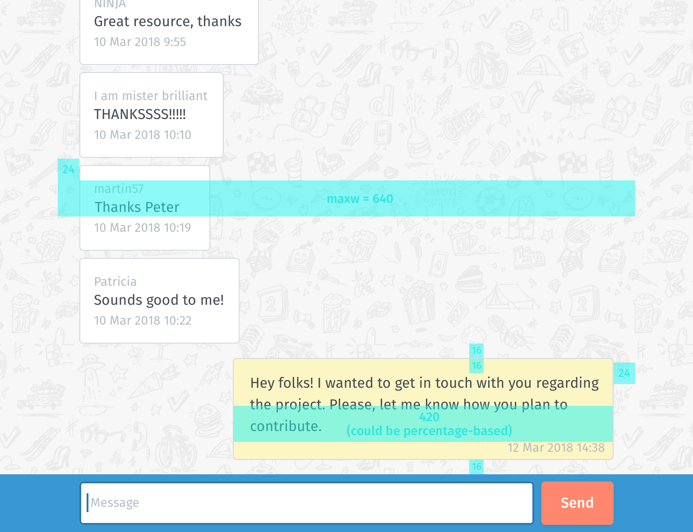
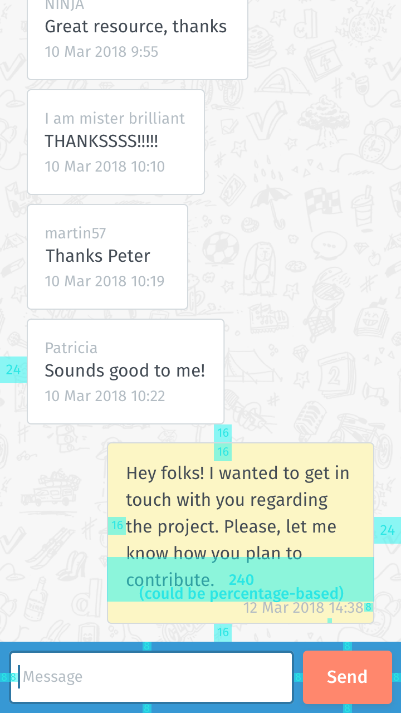

# Doodle Challenge

Take Home assessment for position of Frontend Engineer at Doodle.

## Task requirements

#### We would like you to build a simple **chat interface** in TypeScript that sends and displays messages from all senders.

| desktop                                                             |  mobile                                                           |
| ------------------------------------------------------------------- | ----------------------------------------------------------------- |
|  |  |

Backend: [Frontend Challenge Chat API repository](https://github.com/DoodleScheduling/frontend-challenge-chat-api)

For more information, please check the [hiring challenge](https://github.com/DoodleScheduling/hiring-challenges/tree/master/frontend-engineer).


## 💻 Setup and run

1. As part of the challenge, the a chat interface need to connects to an API. Please follow the documentation to setup up the backend:

   [Doodle Frontend Challenge API](https://github.com/DoodleScheduling/frontend-challenge-chat-api)


1. ‼️ Make sure you have the `.env` file on the root of the project


1. Download and install this repo

   `npm i`


1. Run the project locally

   `npm run dev`


## 📚 Stack

- React
- Typescript
- NextJS
- Jest
- Reat Testing Library
- Tailwind

## 📂 Folder structure

```
🚨 `index` files only do import/exports
```

### Application

```
.
├── assets
├── public
├── src
│   └── app
│       ├── components  // components to be used in multiple places
│       ├── data        // Backend communication
│       ├── features    
│       │   └── Chat    // Chat feature
│       ├── globals.css
│       ├── layout.tsx
│       └── page.tsx
├── ...
├── .env
├── .nvmrc
└── package.json
```

### Component

```
.
└── Component
    ├── Component.tsx     // implementation
    ├── Component.test.tsx // unit test
    └── index.tsx          // exports
```

## Backend integration

In order to deliver real-time updates, a short polling mechanism was implemented (see [polling.ts](./src/app/data/polling.ts)). Although long polling is more performatic, short polling demanded only client-side changes.


## 🎨 Styling

Due to limited time constraints, the tool of choice was inline Tailwind to gain speed. Color variables were set in `global.css` file, in an attempt to keep the visuals consistent. A trade-off is that this approach makes it harder to read and debug styles. Using tools like prettier may help with that.
My preferred architecture would be using CSS modules, creating a Component.style.ts file, for the encapsulation and flexibility it provides.

## 🧪 Testing

### Unit testing

Stack: [Jest](https://jestjs.io/) + [React Testing Library](https://testing-library.com/)

### Integration test

Due to time contraint E2E tests were not implements.

Stack suggested: [cypress](https://www.cypress.io/) 

Coverage:
- Message flow: send → API → display
- Real-time Updates: Polling mechanism and message synchronization
- Error Handling: network/API failures
- State Management: Loading states, error states, message deduplication
- User Experience: Form validation, disabled states


### E2E test

Due to time contraint E2E tests were not implements.

Stack suggested: [cypress](https://www.cypress.io/)

E2E test to check for the whole flow would check for:

- Message Sending: Complete flow from typing to display
- Real-time Updates: Polling mechanism with actual API
- Message History: Persistence across page refreshes


## 👣 Next steps

### Tech

- Setup a Docker container
- Switch the to long-polling for better performance
- Setup Integration tests with Cypress
- Setup E2E tests with Cypress
- Setup accessibility tests with Axe
- Setup eslint configuration
- Setup prettier for Tailwind
- Setup custom configuration for Tailwind
- Improve Error handling
- Add Custom font face that matches the image
- Add tracing, setup dashboards and alerts
- Add analyticy support

### Product / UX

- Name input 😅
- If user is at the bottom and sends new message, scroll to this new message
- Add an indicator that new messages were received
